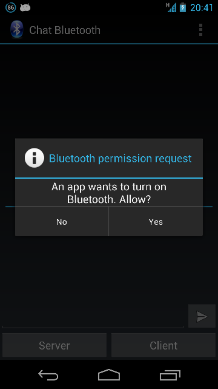
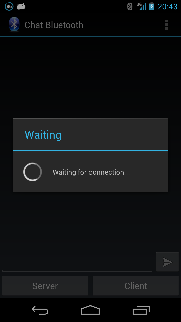
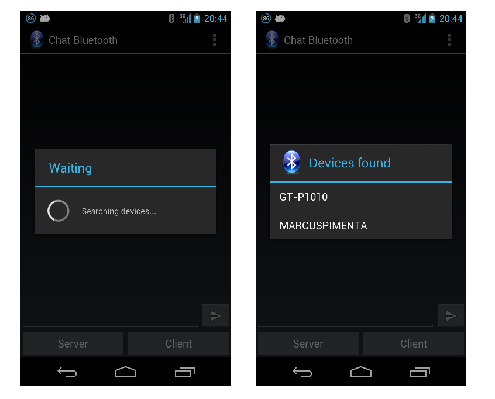
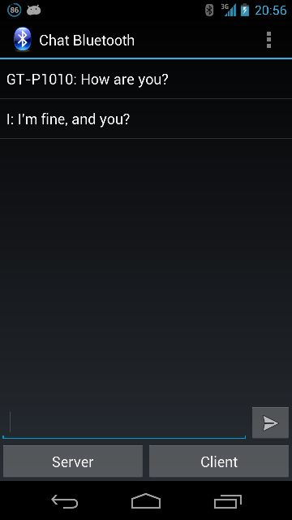

Chat Bluetooth Android
======================

##About
Implement Chat Bluetooth, this allows two devices with Android from version 2.0 can send messages by bluetooth, one of the devices is the server 
connection and the other is the client

##Running
When the application is opened and the bluetooth is disabled, the application asks permission to activate bluetooth

  

The user can choose tow options, server or client. The option server, the device will wait for a connection for 30 seconds

  

The option cliente, the device will search the devices that are visible with bluetooth, when the seach finish show list with
devices founds.

  

After the connection is established the devices can exchange messages

  

##Download
You can download apk in:  
[last version](https://raw.github.com/marcuspimenta/Chat-Bluetooth-Android/master/Bluetooth/bin/Bluetooth.apk)

##Author
Marcus Vinícius Pimenta  
email: [mvinicius.pimenta@gmail.com](mailto:mvinicius.pimenta@gmail.com)
